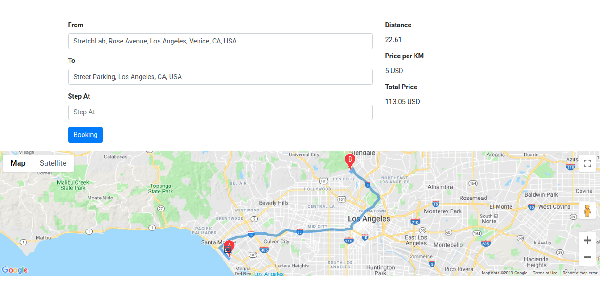

# Taxi Booking Map

## Google Maps

A web page for booking a taxi with some feature to convert address to latitude and longitude to display the route on the map.

## Config

Replace your **API** with `YOUR_API_KEY`.

### Useful References

- Get API: https://developers.google.com/maps/documentation/javascript/get-api-key
- Sample: https://developers.google.com/maps/documentation/javascript/examples/
- Tutorial: https://developers.google.com/maps/documentation/javascript/tutorial
- Documentation: https://developers.google.com/maps/documentation/

## Similar Project

- https://github.com/BaseMax/TaxiMapBooking

## Max Base

My nickname is Max, Programming language developer, Full-stack programmer. I love computer scientists, researchers, and compilers.
[Asrez Team](https://www.asrez.com/)
